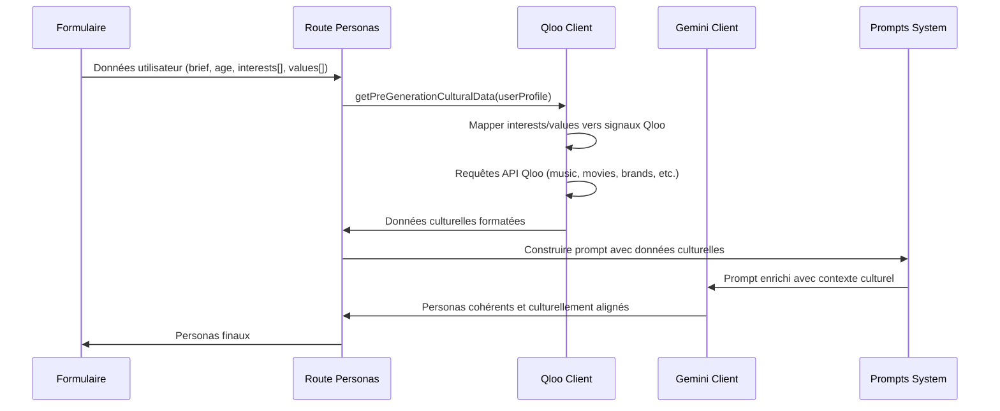

# Design Document

## Overview

Cette refactorisation vise à corriger un défaut architectural critique dans le flux de génération de personas. Le problème actuel est que Gemini génère des personas sans connaître les données culturelles réelles de Qloo, créant des incohérences. La solution consiste à inverser le flux : Qloo → Gemini au lieu de Gemini → Qloo.

**Flux actuel (défectueux) :**
```
Formulaire → Route Gemini → Route Qloo (enrichissement post-génération)
```

**Nouveau flux (corrigé) :**
```
Formulaire → Route Qloo → Route Gemini (génération avec données culturelles)
```

## Architecture

### Diagramme de flux



### Composants modifiés

1. **QlooClient** (`src/lib/api/qloo.ts`)
   - Nouvelle méthode publique `getPreGenerationCulturalData()`
   - Renommage de `enrichPersonas()` en `enrichExistingPersonas()`
   - Nouveau mapping interests/values → signaux Qloo

2. **Route Personas** (`src/app/api/personas/route.ts`)
   - Orchestration du nouveau flux
   - Gestion des fallbacks et erreurs

3. **Système de Prompts** (`src/lib/prompts/gemini-prompts.ts`)
   - Nouvelles variables pour données culturelles
   - Templates mis à jour

4. **Templates de Prompts** (`public/templates/`)
   - Intégration des sections culturelles

## Components and Interfaces

### Nouvelles Interfaces

```typescript
// Interface pour les données utilisateur du formulaire
interface UserProfileForCulturalData {
    age: number;
    location?: string;
    interests: string[];      // Du formulaire
    values: string[];         // Du formulaire
    ageRange?: {
        min: number;
        max: number;
    };
    language?: 'fr' | 'en';
    personaCount?: number;
}

// Interface pour les données culturelles formatées pour les prompts
interface CulturalDataForPrompt {
    music: string[];
    movies: string[];
    tv: string[];
    books: string[];
    brands: string[];
    restaurants: string[];
    travel: string[];
    fashion: string[];
    beauty: string[];
    food: string[];
    socialMediaPreferences: {
        platforms: string[];
        contentTypes: string[];
        influencerTypes: string[];
    };
    demographicInsights: {
        ageGroup: string;
        primaryInterests: string[];
        coreValues: string[];
    };
}

// Interface pour les signaux Qloo
interface QlooSignals {
    'signal.demographics.audiences'?: string;
    'signal.demographics.location'?: string;
    'signal.interests.tags'?: string;
    [key: string]: string | undefined;
}
```

### Méthodes principales

#### QlooClient.getPreGenerationCulturalData()

```typescript
async getPreGenerationCulturalData(
    userProfile: UserProfileForCulturalData
): Promise<CulturalDataForPrompt> {
    // 1. Mapper interests/values vers signaux Qloo
    const signals = this.mapUserInterestsAndValuesToQlooSignals(
        userProfile.interests, 
        userProfile.values
    );
    
    // 2. Récupérer données culturelles en parallèle
    const culturalData = await this.fetchAllCulturalCategories(
        userProfile.age, 
        userProfile.location, 
        signals
    );
    
    // 3. Formater pour les prompts Gemini
    return this.formatCulturalDataForPrompt(culturalData, userProfile);
}
```

#### Mapping Interests/Values → Signaux Qloo

```typescript
private mapUserInterestsAndValuesToQlooSignals(
    interests: string[], 
    values: string[]
): QlooSignals {
    const signals: QlooSignals = {};
    
    // Mapping des intérêts
    const interestMap: Record<string, string> = {
        'Technologie': 'technology',
        'Mode': 'fashion',
        'Sport et fitness': 'fitness',
        'Voyage': 'travel',
        'Cuisine': 'food',
        'Musique': 'music',
        'Gaming': 'gaming',
        'Art': 'art',
        'Photographie': 'photography',
        'Entrepreneuriat': 'business'
    };
    
    // Mapping des valeurs
    const valueMap: Record<string, string> = {
        'Durabilité': 'sustainability',
        'Innovation': 'innovation',
        'Authenticité': 'authenticity',
        'Qualité': 'quality',
        'Créativité': 'creativity',
        'Efficacité': 'efficiency'
    };
    
    // Combiner les signaux
    const allTags = [
        ...interests.map(i => interestMap[i]).filter(Boolean),
        ...values.map(v => valueMap[v]).filter(Boolean)
    ];
    
    if (allTags.length > 0) {
        signals['signal.interests.tags'] = allTags.join(',');
    }
    
    return signals;
}
```

## Data Models

### Structure des données culturelles

```typescript
interface CulturalCategory {
    name: string;
    items: string[];
    relevanceScore: number;
    source: 'qloo' | 'fallback';
}

interface EnrichedCulturalData {
    categories: {
        music: CulturalCategory;
        movies: CulturalCategory;
        tv: CulturalCategory;
        books: CulturalCategory;
        brands: CulturalCategory;
        restaurants: CulturalCategory;
        travel: CulturalCategory;
        fashion: CulturalCategory;
        beauty: CulturalCategory;
        food: CulturalCategory;
    };
    socialMedia: {
        platforms: string[];
        insights: SocialMediaInsights;
    };
    metadata: {
        generatedAt: Date;
        userProfile: UserProfileForCulturalData;
        qlooApiCalls: number;
        cacheHits: number;
    };
}
```

### Templates de prompts mis à jour

Les templates devront inclure de nouvelles variables :

```markdown
{{brief}}

## Contexte Culturel (données Qloo)

### Préférences Musicales
{{culturalData.music}}

### Films et Séries Préférés
{{culturalData.movies}}
{{culturalData.tv}}

### Marques Appréciées
{{culturalData.brands}}

### Plateformes Sociales
{{culturalData.socialMediaPreferences.platforms}}

### Insights Démographiques
- Groupe d'âge : {{culturalData.demographicInsights.ageGroup}}
- Intérêts principaux : {{culturalData.demographicInsights.primaryInterests}}
- Valeurs fondamentales : {{culturalData.demographicInsights.coreValues}}
```

## Error Handling

### Stratégie de fallback en cascade

1. **Niveau 1** : Erreur sur une catégorie Qloo → Utiliser données de fallback pour cette catégorie
2. **Niveau 2** : Erreur générale Qloo → Utiliser toutes les données de fallback
3. **Niveau 3** : Erreur critique → Basculer vers l'ancien flux (Gemini puis Qloo)

```typescript
async getPreGenerationCulturalData(userProfile: UserProfileForCulturalData): Promise<CulturalDataForPrompt> {
    try {
        // Tentative nouveau flux
        return await this.fetchQlooCulturalData(userProfile);
    } catch (error) {
        console.warn('Erreur nouveau flux Qloo, utilisation fallback:', error);
        
        if (this.shouldFallbackToOldFlow(error)) {
            // Fallback vers ancien flux
            return await this.generateFallbackCulturalData(userProfile);
        }
        
        // Fallback données statiques
        return this.getStaticCulturalData(userProfile);
    }
}
```

### Gestion des timeouts et rate limiting

```typescript
private async fetchAllCulturalCategories(
    age: number, 
    location?: string, 
    signals?: QlooSignals
): Promise<EnrichedCulturalData> {
    const categories = ['music', 'movies', 'tv', 'books', 'brands', 'restaurants'];
    const results = new Map<string, CulturalCategory>();
    
    // Traitement par batch pour respecter les limites API
    const batchSize = 3;
    for (let i = 0; i < categories.length; i += batchSize) {
        const batch = categories.slice(i, i + batchSize);
        
        const batchPromises = batch.map(async category => {
            try {
                const data = await this.fetchDataWithSignals(category, age, location, signals);
                return { category, data, source: 'qloo' as const };
            } catch (error) {
                console.warn(`Fallback pour ${category}:`, error);
                return { 
                    category, 
                    data: this.getFallbackDataForType(category), 
                    source: 'fallback' as const 
                };
            }
        });
        
        const batchResults = await Promise.all(batchPromises);
        batchResults.forEach(({ category, data, source }) => {
            results.set(category, {
                name: category,
                items: data,
                relevanceScore: source === 'qloo' ? 85 : 60,
                source
            });
        });
        
        // Délai entre les batches
        if (i + batchSize < categories.length) {
            await this.sleep(300);
        }
    }
    
    return this.buildEnrichedCulturalData(results);
}
```

## Testing Strategy

### Tests unitaires

1. **QlooClient.getPreGenerationCulturalData()**
   - Test avec données complètes
   - Test avec données partielles
   - Test avec erreurs API
   - Test des fallbacks

2. **Mapping interests/values**
   - Test de tous les mappings définis
   - Test avec intérêts/valeurs non reconnus
   - Test avec tableaux vides

3. **Formatage pour prompts**
   - Test de la structure de sortie
   - Test avec données manquantes
   - Test de la cohérence des données

### Tests d'intégration

1. **Flux complet nouveau**
   - Formulaire → Qloo → Gemini → Résultat
   - Vérification de la cohérence des personas générés

2. **Fallback vers ancien flux**
   - Simulation d'erreurs Qloo
   - Vérification du basculement automatique

3. **Performance**
   - Mesure du temps de génération
   - Test de charge avec requêtes simultanées

### Tests de régression

1. **Compatibilité ascendante**
   - Vérification que l'ancien flux fonctionne toujours
   - Test des APIs existantes

2. **Qualité des personas**
   - Comparaison qualitative ancien vs nouveau flux
   - Métriques de cohérence culturelle